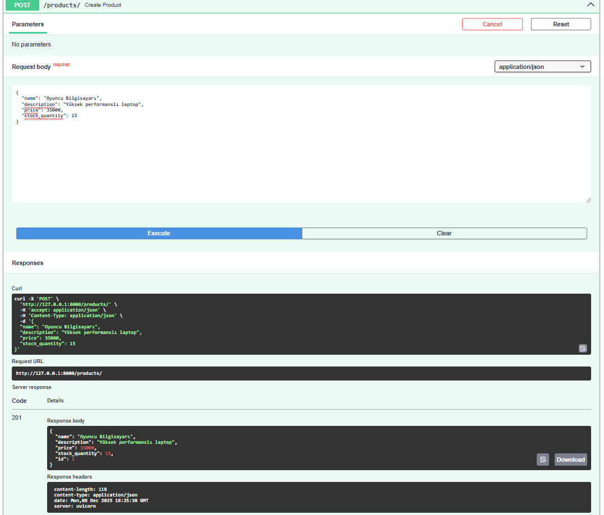
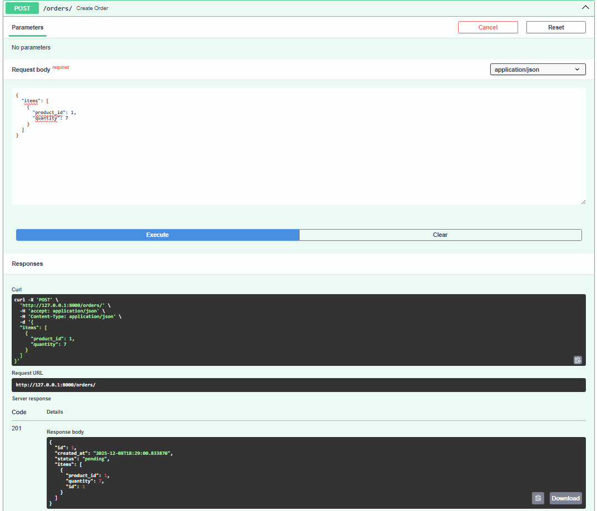
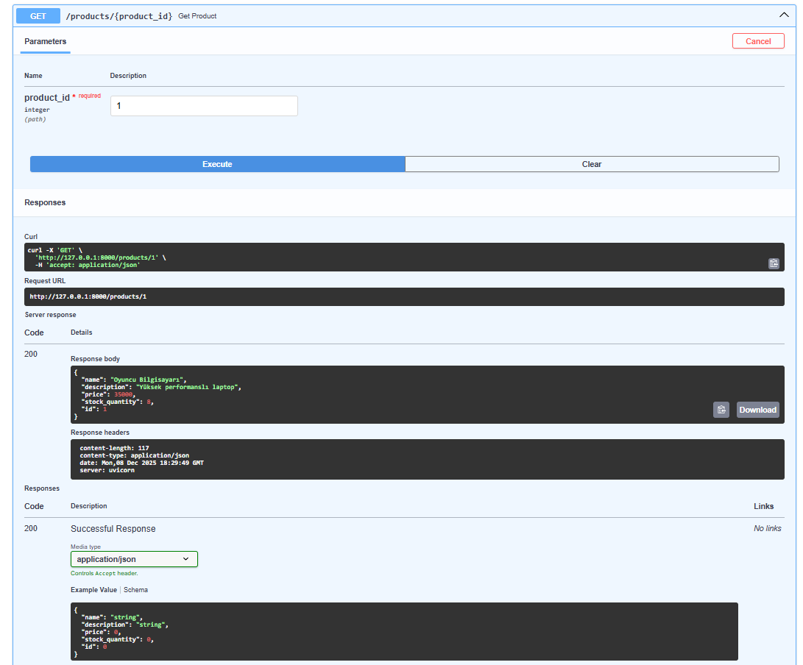
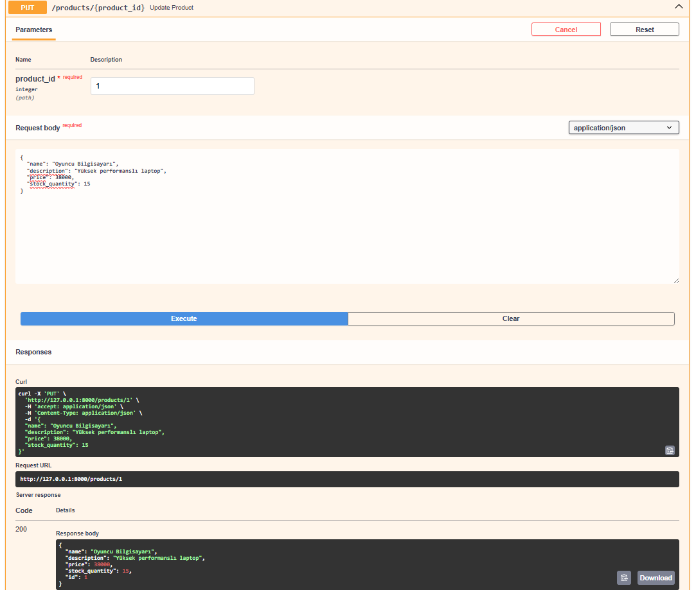
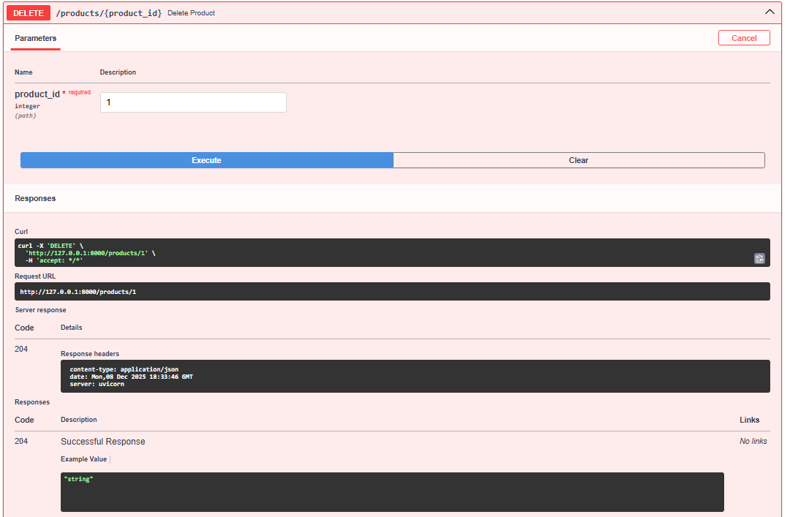

# FastAPI E-Commerce Core 🚀

A robust, production-ready REST API for an E-Commerce backend built with **FastAPI**, **SQLAlchemy**, and **Python**.

## 📖 Overview
This project serves as a comprehensive backend core for managing products, orders, and inventory systems. It is designed with **Clean Architecture** principles, ensuring modularity, scalability, and ease of maintenance.

## ✨ Features
*   **Product Management**: CRUD operations for products (Create, Read, Update, Delete).
*   **Order Processing**: Smart order placement with automatic **Stock Validation** and **Deduction**.
*   **Atomic Transactions**: Ensures database integrity during order creation.
*   **Interactive Documentation**: Automatic Swagger UI for API testing.
*   **Container Ready**: Fully Dockerized for easy deployment.

## � API Demo Walkthrough
Here is the core functionality in action:

### 1. Create a Product
We create a "Gaming Laptop" with **10 units** of stock.


### 2. Place an Order
We place an order for **2 units** of the laptop. The system automatically checks availability.


### 3. Verify Stock Deduction
After the order, we check the product details. The stock has correctly dropped to **8**.


### 4. Update Product
We can modify product details (e.g. price or description) anytime.


### 5. Delete Product
Cleaning up! We delete the product when it's no longer needed.


## �🛠️ Tech Stack
*   **Framework**: [FastAPI](https://fastapi.tiangolo.com/) (High-performance web framework)
*   **Database**: SQLite (Dev) / Easy switch to PostgreSQL (Prod) via SQLAlchemy ORM
*   **Validation**: [Pydantic](https://docs.pydantic.dev/) Data validation schemas
*   **Server**: Uvicorn (ASGI Server)
*   **Containerization**: Docker

## 🚀 Getting Started

### Option 1: Run Locally (Recommended for Dev)

<details>
<summary><strong>👇 Click here to see Windows Instructions</strong></summary>

1.  **Clone the repository**
    ```bash
    git clone https://github.com/YourUsername/FastAPI-Ecommerce-Core.git
    cd FastAPI-Ecommerce-Core
    ```

2.  **Create a Virtual Environment (One time only)**
    ```powershell
    # Windows
    python -m venv .venv
    ```

3.  **Run the Server**
    ```powershell
    # Windows (Copy and paste this)
    .\.venv\Scripts\python -m pip install -r requirements.txt
    .\.venv\Scripts\python -m uvicorn app.main:app --reload
    ```

4.  **Access the API**
    Open [http://127.0.0.1:8000/docs](http://127.0.0.1:8000/docs) to view the Swagger UI.

</details>

### Option 2: Run with Docker 🐳

1.  **Build the Image**
    ```bash
    docker build -t ecommerce-core .
    ```

2.  **Run the Container**
    ```bash
    docker run -d -p 80:80 ecommerce-core
    ```
    Access at `http://localhost/docs`.

## 📂 Project Structure
```
FastAPI-Ecommerce-Core/
├── app/
│   ├── main.py          # Application entry point
│   ├── database.py      # Database connection & session
│   ├── models.py        # SQLAlchemy Database Models
│   ├── schemas.py       # Pydantic Schemas (Validation)
│   └── routers/         # API Route Handlers
│       ├── products.py
│       └── orders.py
├── screenshots/         # Demo verification images
├── Dockerfile           # Docker configuration
├── requirements.txt     # Python dependencies
└── README.md            # Project documentation
```

## 🧪 API Endpoints
| Method | Endpoint | Description |
| :--- | :--- | :--- |
| `GET` | `/products` | List all products |
| `POST` | `/products` | Create a new product |
| `POST` | `/orders` | Create an order (Deducts stock!) |

## 📜 License
This project is open-source and available under the **MIT License**.
